# liblloyal

[](https://github.com/lloyal-ai/liblloyal/actions/workflows/tests.yml)
[](LICENSE)
[](https://en.cppreference.com/w/cpp/20)
[](https://github.com/ggml-org/llama.cpp/releases/tag/b9581)

**Covalent Inference for llama.cpp**

Composable C++ primitives for forkable decode state and shared-prefix (KV) branching. Fork a generation into a tree — branches share a prefix while keeping independent machinery (sampler chain, seed, grammar, logits snapshot, perplexity tracker) for controlled divergence at decode time.

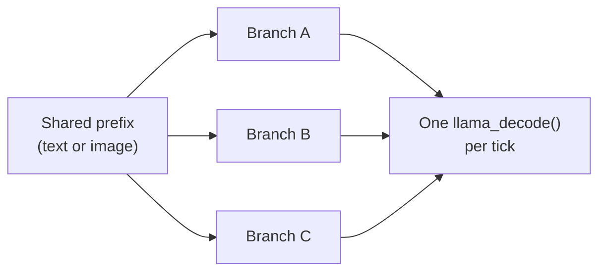

## Continuous Tree Batching

Tree search with N branches normally means N calls to `llama_decode()`, each paying dispatch overhead, memory barriers and PCIe round-trips. `BranchStore` packs tokens from N branches — each at a **different position**, on a **different seq_id**, each needing **independent logits** — into one `llama_batch`.

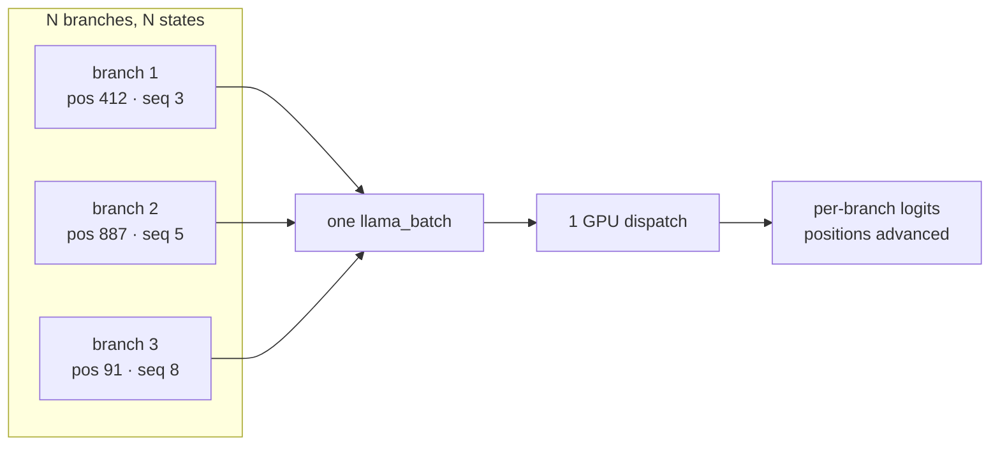

```cpp
// Tree search inner loop: all branches advance in one GPU dispatch
store.decode_each({{child1.handle(), tok1},
                   {child2.handle(), tok2},
                   {child3.handle(), tok3}});
```

### Two packing strategies

`decode_each` is one token per branch. `decode_scatter` takes **variable-length** runs and greedy bin-packs them to fill `n_batch`:

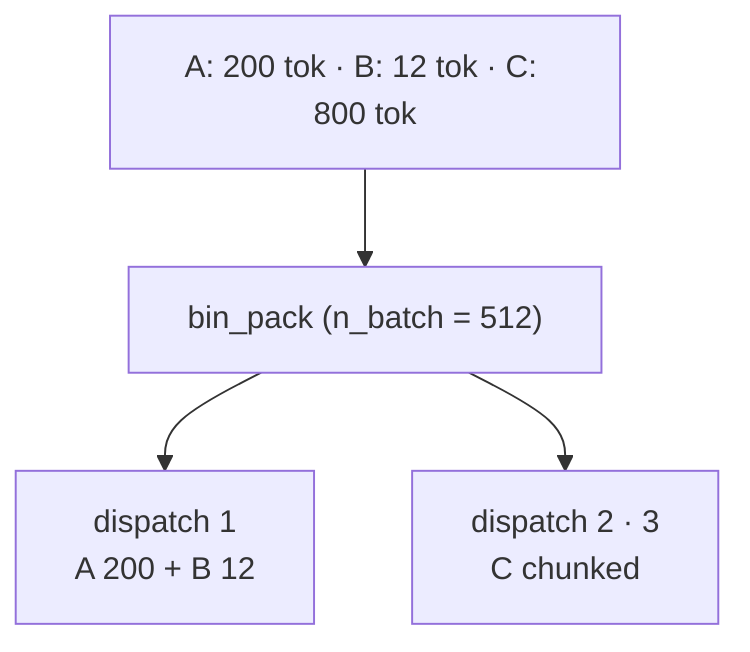

```cpp
store.decode_scatter({
    {branchA.handle(), system_tokens},  // 200 tokens
    {branchB.handle(), query_tokens},   //  12 tokens
    {branchC.handle(), doc_tokens},     // 800 tokens
});
// Oversized items fall back to chunked single-sequence decode.
```

### The decode grid

`decode.hpp` holds the free functions; `BranchStore` wraps the ones that need branch state.

|                    | Single Sequence  | Multi Sequence    |
|--------------------|------------------|-------------------|
| **Single Token**   | `decode::one`    | `decode::each`    |
| **Multi Token**    | `decode::many`   | `decode::scatter` |
| **Embedding Rows** | `decode::embd`   | —                 |

> Embedding rows have no multi-sequence cell: a `llama_batch` is token-**XOR**-embd, so an image is always its own dispatch and never bin-packs with text.

## BranchStore

Two tables and three registries, all instance-scoped — no global state.

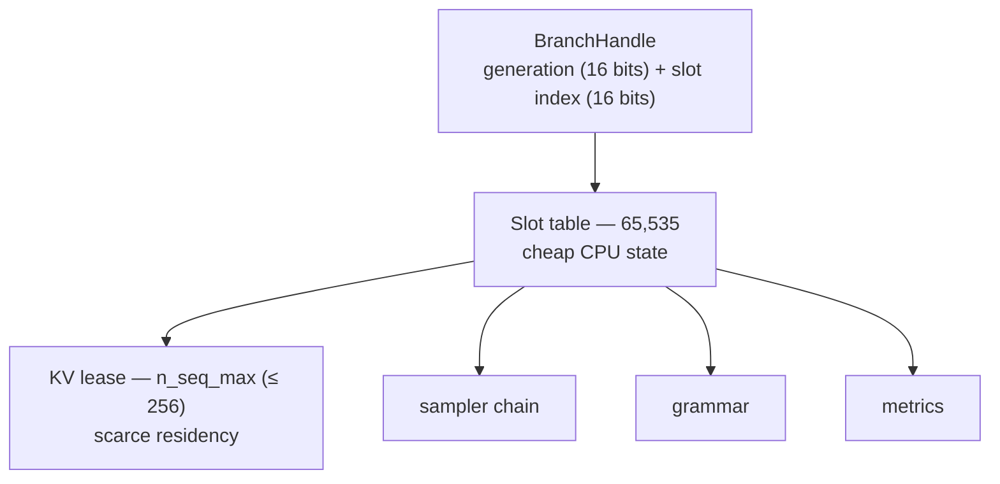

Slots are how many branches can **exist**; leases are how many can **decode**. The generation counter in the upper 16 bits makes a stale handle detectable after slot reuse, so a freed branch's handle fails loudly instead of aliasing a new one.

### Lifecycle

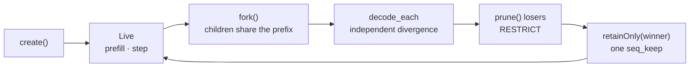

Search is **surgical** (N × `prune()`); promotion is **nuclear** (1 × `retainOnly()`, a single `seq_keep` pass that vaporizes every loser).

**`fork()` clones:** KV sequence, sampler chain (penalties, PRNG, filters), grammar state, metrics, logits snapshot, logit bias, cached sampler params.
**`fork()` does not clone:** the steer callback — it captures references, so copying it is unsafe. Call `set_steer()` on the child if needed.

> Logits are cloned by **default** (`clone_logits = true`), not left empty — a child can sample immediately. Pass `false` to skip the copy (~`n_vocab × 4` bytes; ~600 KB at 150k vocab) when the child will prefill before sampling.

## The Embedding Rail (Multimodal)

Images are not described in text before reaching the model. They are decoded, projected into the model's **native input embeddings**, and admitted through `llama_batch.embd` beside the token stream. Once admitted they are ordinary live inference state — forkable, shareable, governed by the same branch lifecycle as text.

Three responsibilities, deliberately separated:

| Layer | Owns |
|---|---|
| `SegmentSource` | Producing ordered TEXT / EMBD segments and their position geometry |
| `BranchStore::decode_segments` | Placement: position, KV cells, slack, terminal logits |
| `decode::` primitives | Packing the right `llama_batch` and dispatching it |

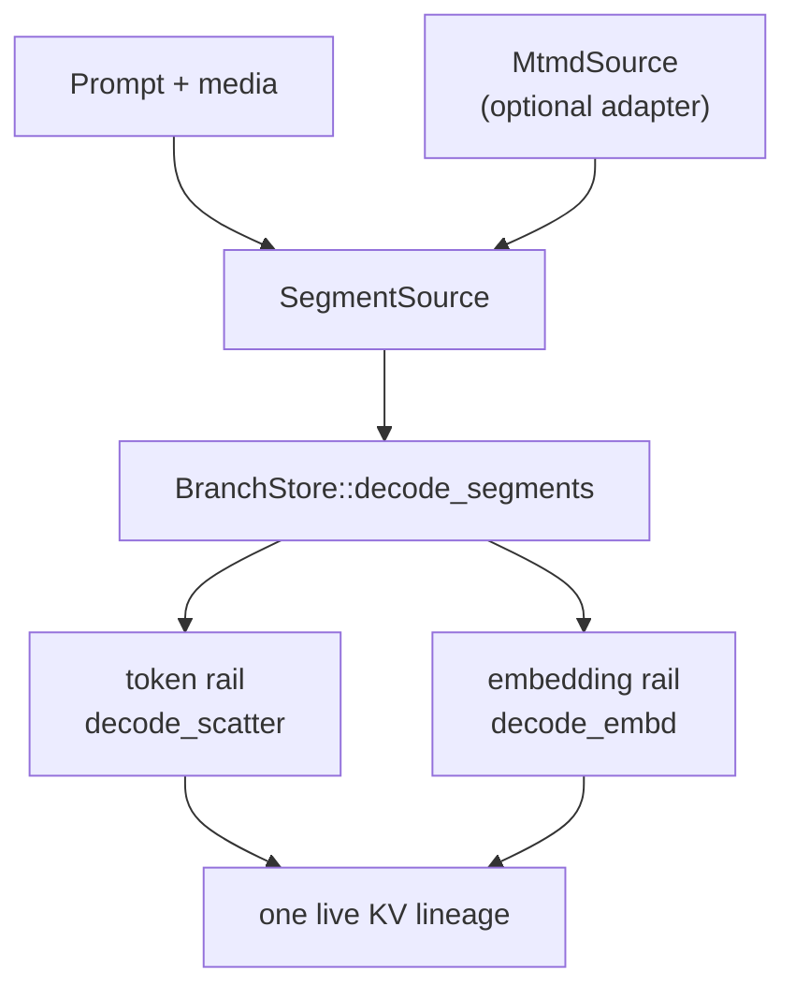

### The portability seam

`SegmentSource` exposes exactly two kinds of input — `TEXT` (token ids) and `EMBD` (embedding rows plus position geometry). The kernel never sees images, codecs, file formats or `mtmd_*` types; the source never sees a seq_id and never mutates branch position. A binding can therefore use llama.cpp's mtmd, a platform-native encoder, or cached embeddings without reimplementing KV placement.

```cpp
MtmdSource source(mtmd_ctx, prompt, images, separator, n_embd_inp);
auto result = store.decode_segments(branch.handle(), source);
```

`MtmdSource` is the optional llama.cpp adapter, behind `<lloyal/mtmd.hpp>`. Its **constructor** validates marker/image counts, decodes the image bytes, tokenizes the interleaved prompt, and rejects unsupported media. The **projector runs lazily**, per segment, during the walk — which is exactly what lets an encoder reuse one output buffer: each segment is dispatched before the next is requested.

Consumers that neither include the header nor link `mtmd` carry no multimodal dependency.

### One ordered prefill, two rails

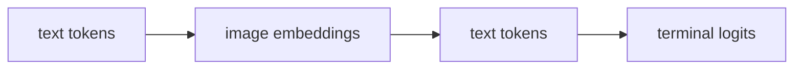

`decode_segments()` walks the sequence strictly in order, sending TEXT through `decode_scatter` and EMBD through `decode_embd`. Both advance the same branch. Placement stays in the store: the source describes how a segment is positioned *relative to a base*, and the store supplies the absolute base — so branch position never crosses into a binding or a codec.

### KV cells and logical position are different quantities

For text, one token is one cell and one position. Multimodal position schemes separate them: an image contributes `n_rows` embeddings while advancing the branch by only `n_pos` — under M-RoPE that is `max(nx, ny)`, reported by the codec rather than computed here.

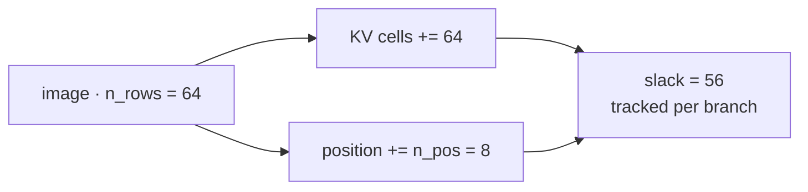

The gap is recorded as embedding-row slack — own and inherited — so `fork()`, `release()` and `retainOnly()` recover exact cell counts. A branch reports the logical position the model expects while tenancy still accounts for every physical cell the image occupies.

### The image becomes shared live state

Downstream of the KV, everything is modality-agnostic: a cell does not remember whether it came from `.token` or `.embd`. Forking after an image shares its cells via `kv::seq_cp` — no re-encode, no copy — so N branches attend one image (see [Continuous Tree Batching](#continuous-tree-batching)).

> Media is not an attachment resent with every call. It becomes part of the live inference lineage that further computation forks from.

### Decode invariants

The embedding rail enforces what keeps that lineage valid:

- embedding width must match the **resident model's** input width — `llama_batch` carries no width, so a wrong one reads past the caller's buffer;
- segment geometry is validated **before** allocation or any source callback;
- a non-causal block must fit one batch **and** micro-batch — splitting it would silently stop it being bidirectional;
- causal attention is restored by RAII on every exit, including a throw;
- empty segments are rejected, so terminal-logit selection stays unambiguous;
- unsupported media is rejected before any dispatch.

> **Not transactional.** Once the first segment is dispatched the branch is mutated. A later error leaves it partially advanced — prune and rebuild rather than continuing from it.

## Hot-Swap Sampler & Grammar

Sampler chains, grammars and metrics live in handle-based registries on the store. `set_sampler_params()` memoizes — unchanged params are a no-op. `set_grammar()` swaps mid-generation.

```cpp
// EDT: adapt temperature per token from model entropy
float entropy = metrics::model_entropy(root.logits(), root.n_vocab());
root.setSamplerParams(MyParams{.temperature = T0 * std::pow(N, THETA / std::max(entropy, 0.1f))});

root.setGrammar(json_gbnf);   // constrain to JSON
root.setGrammar(nullptr);     // release
```

Handles free automatically on `prune()`.

## KV Tenancy

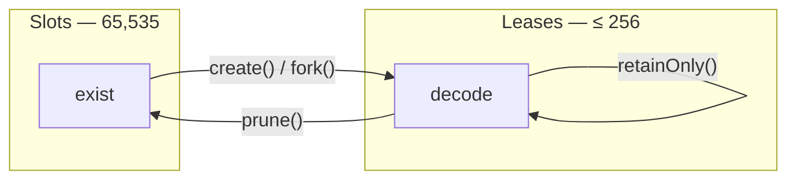

```cpp
store.available();        // leases left — your width/depth budget
store.retainOnly(winner);  // 1 seq_keep, vacancy rebuilt
store.drain();             // explicit teardown before llama_free(ctx)
```

Consumers never see raw seq_ids.

## Topology

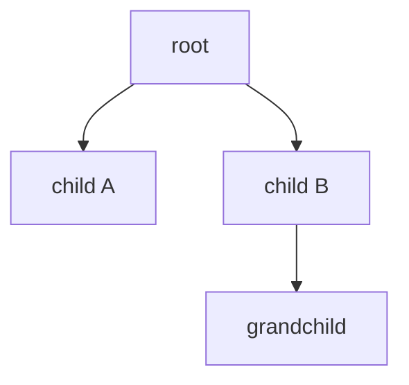

```cpp
store.parent(handle);    store.children(handle);
store.isLeaf(handle);    store.isActive(handle);
```

| Method | FK analogy | Behavior |
|--------|-----------|----------|
| `prune()` | RESTRICT | Throws if children exist |
| `pruneSubtree()` | CASCADE | Iterative post-order traversal |

RAII `~Branch()` uses CASCADE, so cleanup always succeeds even on deep trees. Multi-tag KV cells mean pruning a parent cannot corrupt a child's cache — a cell is freed only when every tag is gone.

## Primitives

- **Tokenization** — two-pass safe sizing, special-token handling
- **Decoding** — continuous tree batching, cross-sequence packing, embedding-row injection
- **KV Cache** — tenancy, sequence ops, state snapshots, long-context compression
- **Sampling** — grammar-constrained, persistent chains, memoized hot-swap
- **Metrics** — dual-level entropy/surprisal, rolling perplexity, cloneable
- **Embeddings** — pooled extraction, L2 normalization, similarity
- **Chat Templates** — Jinja2 formatting with fallbacks

```cpp
auto chain  = lloyal::sampler::create_chain(params);
auto gram   = lloyal::grammar::init_sampler(model, schema);
auto model1 = lloyal::ModelRegistry::acquire(path, params);
auto model2 = lloyal::ModelRegistry::acquire(path, params);  // cache hit
```

## From Simple to Complex

**Single-sequence streaming** — the baseline:

```cpp
lloyal::decode::many(ctx, prompt.data(), prompt.size(), 0, n_batch);
while (!done) {
    auto token = lloyal::sampler::sample_with_params(ctx, vocab, params);
    lloyal::decode::one(ctx, token, n_past++);
}
```

**Best-of-N** — fork once, diverge, keep the best:

```cpp
using namespace lloyal::branch;
BranchStore store;
store.init_tenancy(ctx);

auto root = Branch::create(ctx, model, store, /*start_pos*/ 0, params);
root.prefill(prompt.data(), prompt.size());

std::vector<Branch> candidates;
for (int i = 0; i < 8; i++) {
    candidates.push_back(root.fork());
    auto p = params; p.seed = 1000 + i;      // different PRNG per candidate
    candidates.back().setSamplerParams(p);   // memoized: a new seed rebuilds
}

for (int t = 0; t < 64; t++) {
    std::vector<DecodeEachItem> items;
    for (auto& c : candidates) {
        auto tok = c.sample();
        c.accept(tok);
        items.push_back({c.handle(), tok});
    }
    store.decode_each(items);   // 8 branches, 1 llama_decode()
}

auto& winner = *std::min_element(candidates.begin(), candidates.end(),
    [](auto& a, auto& b) { return a.perplexity() < b.perplexity(); });
store.retainOnly(winner.handle());
```

**Tree search** — expand, evaluate, prune, promote:

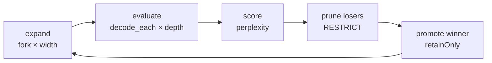

```cpp
for (int turn = 0; turn < max_turns; turn++) {
    std::vector<Branch> leaves;
    int width = std::min((int)store.available(), max_width);
    for (int i = 0; i < width; i++) {
        auto leaf = root.fork();
        auto p = params; p.seed = turn * 1000 + i;
        leaf.setSamplerParams(p);
        leaves.push_back(std::move(leaf));
    }

    for (int d = 0; d < depth; d++) {
        std::vector<DecodeEachItem> items;
        for (auto& leaf : leaves) {
            auto tok = leaf.sample();
            leaf.accept(tok);
            items.push_back({leaf.handle(), tok});
        }
        store.decode_each(items);
    }

    std::sort(leaves.begin(), leaves.end(),
        [](auto& a, auto& b) { return a.perplexity() < b.perplexity(); });
    for (size_t i = 1; i < leaves.size(); i++) leaves[i].prune();

    store.retainOnly(leaves[0].handle());
    root = std::move(leaves[0]);
}
```

> `store.decode_each` / `decode_scatter` take `DecodeEachItem` / `DecodeScatterItem` (branch-aware). The free functions in `decode::` take `decode::EachItem` / `decode::ScatterItem` and raw seq_ids — a lower layer, not interchangeable.

## Architecture

- **Header-only** — everything inline in `include/lloyal/*.hpp`
- **Managed KV residency** — `kv::tenancy` owns leases; consumers never see raw seq_ids
- **Handle-based** — generation counters prevent ABA on slot reuse; registries are store-scoped
- **Shared model weights** — thread-safe registry, multi-context with one model load
- **Zero runtime dependencies** — C++20 standard library + llama.cpp
- **Multi-binding** — C++20 concepts decouple from binding types (Node.js, React Native, CLI)

## Integration

```bash
git submodule add -b v0.1.0 https://github.com/lloyal-ai/liblloyal.git
```

```cmake
add_subdirectory(liblloyal)
target_link_libraries(your_target PRIVATE liblloyal::liblloyal)
```

`liblloyal` links `llama` (and `common`, when present) transitively. Multimodal is opt-in: include `<lloyal/mtmd.hpp>` and link llama.cpp's `mtmd` yourself — liblloyal links nothing on your behalf.

```ruby
# CocoaPods (iOS)
s.header_dir   = "lloyal"
s.source_files = "liblloyal/include/**/*.{hpp,h}"
```

## Documentation

- **Usage guide:** [`docs/guide.md`](docs/guide.md)
- **API reference:** [lloyal-ai.github.io/liblloyal](https://lloyal-ai.github.io/liblloyal/) — or `./scripts/generate-docs.sh`
- **Headers:** `include/lloyal/*.hpp`, fully Doxygen-annotated

## Testing

262 unit tests (stubbed — tenancy, topology, tree batching, RESTRICT/CASCADE, registries, embedding-rail accounting) and 167 integration tests against real llama.cpp, plus ASan / UBSan / LeakSan.

```bash
# Unit — no model required
cd tests && cmake -B build && cmake --build build && ./build/TestRunner

# Integration — real llama.cpp
cd tests && cmake -B build_integration -DLLOYAL_BUILD_INTEGRATION_TESTS=ON \
  -DLLAMA_CPP_DIR=../../llama.cpp && cmake --build build_integration
LLAMA_TEST_MODEL=path/to/model.gguf ./build_integration/IntegrationRunner

# Multimodal cases additionally need a matched VL pair
LLAMA_TEST_MODEL=model.gguf LLAMA_MMPROJ_MODEL=mmproj.gguf \
  ./build_integration/IntegrationRunner -tc="multimodal*"
```

## Design Principles

1. **Primitives, not opinions** — build your patterns, we provide the tools
2. **Managed scarcity** — leases are automatic; capacity is queryable
3. **Explicit over implicit** — no hidden state, clear contracts
4. **Testable** — no framework coupling, works standalone
5. **Version-isolated** — absorbs llama.cpp API changes

## Contributing

See [CONTRIBUTING.md](CONTRIBUTING.md).

## License

You can build and sell commercial products using liblloyal.

liblloyal 3.0 is source-available under FSL-1.1-Apache-2.0 and converts to
Apache 2.0 two years after each release. The restriction is narrow: you
cannot offer a competing HDK runtime, managed HDK service, or alternative
HDK App distribution channel.

See [`LICENSE-FAQ.md`](./LICENSE-FAQ.md) for concrete examples of what's
permitted and what's restricted. See [`LICENSE`](./LICENSE) for the legal
text and [`NOTICE`](./NOTICE) for attribution including the bundled
llama.cpp MIT dependency.
